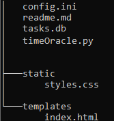
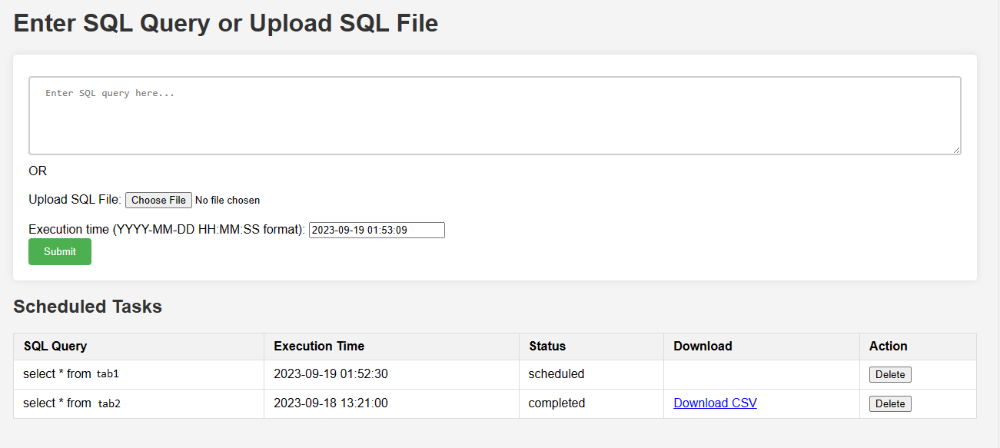

timerOracle
input SQL and the set timer to run it. The SQL is executed at the scheduled time. Users can download the resulting CSV from the provided link.

Directory structure 

/app 
    timerSql.py 
    config.ini 
    /templates 
        index.html 
    /static 
        styles.css
create directory templates, copy index.html to this directory. create directory static,copy styles.css to this directory.

1 timerSql.py Importing required modules:Flask Cx_oracle APScheduler Initializing Flask application. Reading the database configuration. 
Setting up a background scheduler. SQLite database initialization and table creation.

Flask routes for: Main index Scheduling jobs Downloading CSV files Executing SQL Getting the latest tasks

@app.route('/'): Renders the index.html template and displays all scheduled tasks. \
@app.route('/schedule_job', methods=['POST']): Allows users to schedule tasks by providing an SQL query and a time to run the query. The task is then added to the SQLite database.\
@app.route('/download/'): Allows users to download the result CSV files. Task Execution: The execute_sql function connects to the database, runs the provided SQL query, and saves the result in a CSV file. Once the task is completed, its status is updated in the SQLite database.

APScheduler: The APScheduler runs in the background and calls the execute_sql function at the specified times.

2 index.html file is a template for displaying the main interface of the SQL Scheduler web application, input an SQL query or upload a sql file and specify a time, display all scheduled tasks, execution time, status, and download links for completed tasks.

